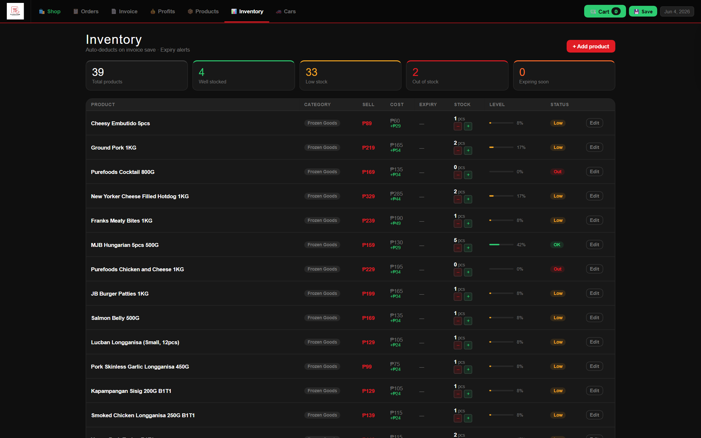

# Checkout Hub PH

The app that started everything. I run a small frozen-goods business, and I was tracking sales in a notebook and losing track of stock constantly. No off-the-shelf tool worked the way my day actually runs — so I built my own. It's been managing the business ever since, and building it is what got me into full-stack development.

**Live:** [checkout-hub-ph.vercel.app](https://checkout-hub-ph.vercel.app)

## What it does

One business manager for a small shop, organized into tabs:

- **Shop** — product catalog with cart-style checkout for walk-in sales
- **Orders** — order tracking from placed to paid
- **Invoice** — sales invoices with printable receipts
- **Profits** — daily and monthly profit view, cost vs. sell per item
- **Products** — the catalog itself: pricing, categories, cost tracking
- **Inventory** — stock levels with low-stock and expiry alerts; auto-deducts when an invoice is saved
- **Reports & Settings** — CSV export, print/PDF, business details, backup and restore

## How it's built

The whole app is one HTML file — vanilla JavaScript, no framework, no build step. Data lives in `localStorage` on the owner's device, with JSON backup/restore and CSV export so nothing is ever locked in. A service worker makes it an installable, offline-first PWA: it works with no signal, which matters in the Philippines.

That single-file constraint is deliberate. It deploys anywhere, loads fast on cheap phones, and the owner owns their data completely — there's no server to pay for or go down.

## Running it

Open `index.html` in a browser. That's it. (Or serve the folder and install it as a PWA.)
